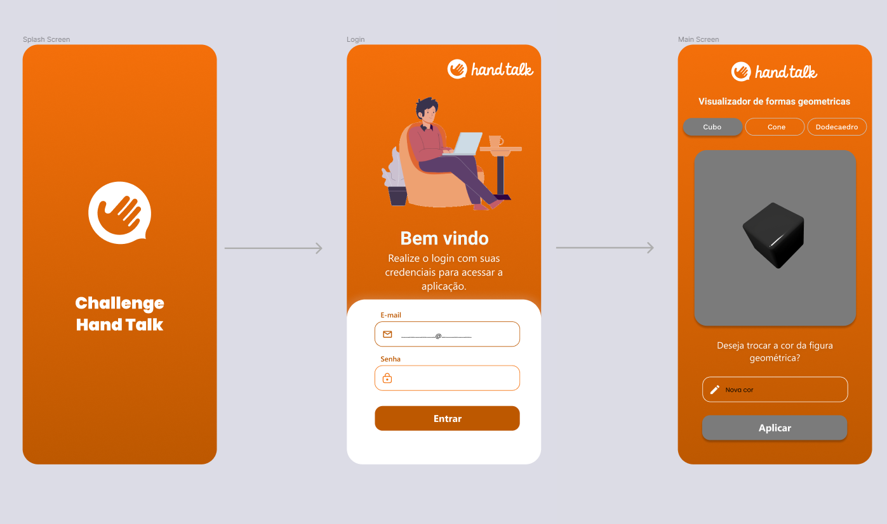

<br />
<p align="center">
  <a href="https://www.handtalk.me/br">
    
  </a>
  <h3 align="center">Hand Talk</h3>

  <p align="center">
    Project carried out with the purpose of implementing the technical challenge for the selection process for the position of React-Native developer at handtalk.
  </p>
</p>

<details open="open">
  <summary>Table of Contents</summary>
  <ol>
    <li>
      <a href="#About the project">About the project</a>
      <ul>
        <li><a href="#Built with">Built with</a></li>
      </ul>
    </li>
    <li>
      <a href="#Firststeps">First steps</a>
      <ul>
        <li><a href="#Installation">Installation</a></li>
      </ul>
    </li>
    <li><a href="#Prints">Prints of the developed application</a></li>
  </ol>
</details>

## About the project
Project carried out with the purpose of implementing the technical challenge for the selection process for the position of react native developer at handtalk.

The project consists of creating an application that meets the topics described in the <a href="./assetsREADME/Desafio Hand Talk - React Native[2529].pdf">requirements document</a>. 

Main points:
- Rendering of 3D objects using THREE.js;
- Authentication using Firebase;
- Visual alteration of the objects from the Realtime Database query;


## Built with
Technologies and frameworks that were used throughout the implementation of the application

* [React-Native](https://reactnative.dev)
* [Expo](https://expo.io) 
* [Yarn](https://yarnpkg.com)
* [TypeScript](https://www.typescriptlang.org/)
* [Figma](https://www.figma.com/)

## Installation

1. Clone the repository
  ```sh
   git clone https://github.com/GabrielPassos25/ChallengeHandTalk.git
   ```

2. Install the dependencies
  ```sh
  yarn
   ```

3. Start the server
  ```sh
   expo start
   ```

4. To run the aplication, just scan the QR code to open it on a physical device. (**NOTE: The application, because of the emulator's native features, only works on physical devices. Make sure you are running on a PHYSICAL device**) 

5. Evaluate the application :smile:

## Important Points
- The application, because of the emulator's native features, only works on physical devices. Make sure you are running on a PHYSICAL device.

- By default, all colors will start, directly in the database, as white. When you make the first change, the colors will already be synchronized automatically.

- Below I list the credentials available to access the application:

| Available Users |   | Password |
| :-----: | :-: | :-: |
| avaliador1@gmail.com |  | 123456789 |
| avaliador2@gmail.com |  | 123456789 |

- Colors available for alteration (**NOTE: Follow exactly the way the color is written. The application is case sensitive.**):

| Available Colors | 
| :-----: |
| green |
| blue | 
| red | 
| white | 
| purple | 
| black | 
| yellow | 

### Main features to be added
- Splash Screen
  - [x] Create splash screen;
- Login Screen
  - [x] Add logo -> HandTalk;
  - [x] Add animation using lootieview;
  - [x] User authentication using firebase authenticator;
  - [x] Validate correct email and password input;
  - [x] Alert for invalid credentials;
- Home Screen
  - [x] Add options to render the selected geometric shape;
  - [x] Add shadow to the geometric shape;
  - [x] Rotate geometric shape;
  - [x] Perform color synchronization with the realtime database;
  - [x] Add input to change color and synchronize change in database;
  - [x] Invalid color alert;
  - [x] Avoid input overlap with the keyboard;
  - [ ] Invalid color bug in android -> Apparently, when trying to put an invalid color in android, the error condition is not being validated and the color goes invalid in the database. However, when trying to change the color to a valid color, the change occurs normally. **(NOTE: THIS DOES NOT HAPPEN ON IOS. VALIDATION OCCURS AND THE COLOR IS NOT CHANGED)**
- Emulator Issue
  - [ ] Investigate native emulator error

## Prints
<a href="https://www.figma.com/file/7muiBa3MVMuood6zDHWtSF/Challenge-Hand-Talk?node-id=0%3A1">Mockup and style guide</a> created to serve as a guide for project implementation using Figma. 

 <a href="./assetsREADME/Mockup.png">
    
 </a>

Abaixo, ilustro algumas das telas implementadas, de acordo com o protótipo do figma.
- Iphone:
https://user-images.githubusercontent.com/47640031/131271940-3de48cb7-e559-4127-8eb8-cb4357ab6d7c.MP4

- Android:
https://user-images.githubusercontent.com/47640031/131271902-2b0985d5-619a-4c4f-ac7c-9af76540e37d.MP4
